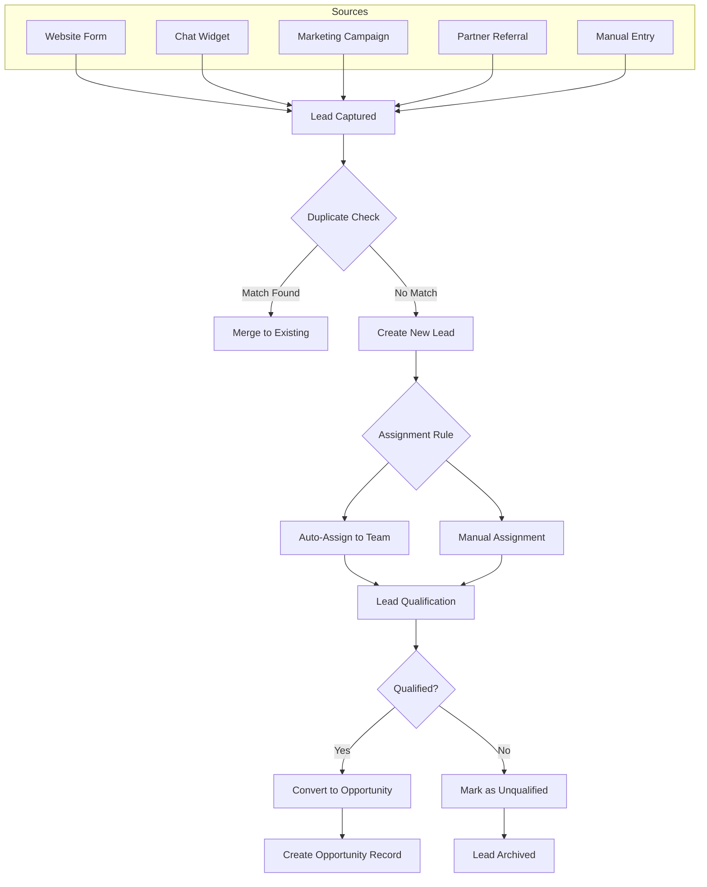
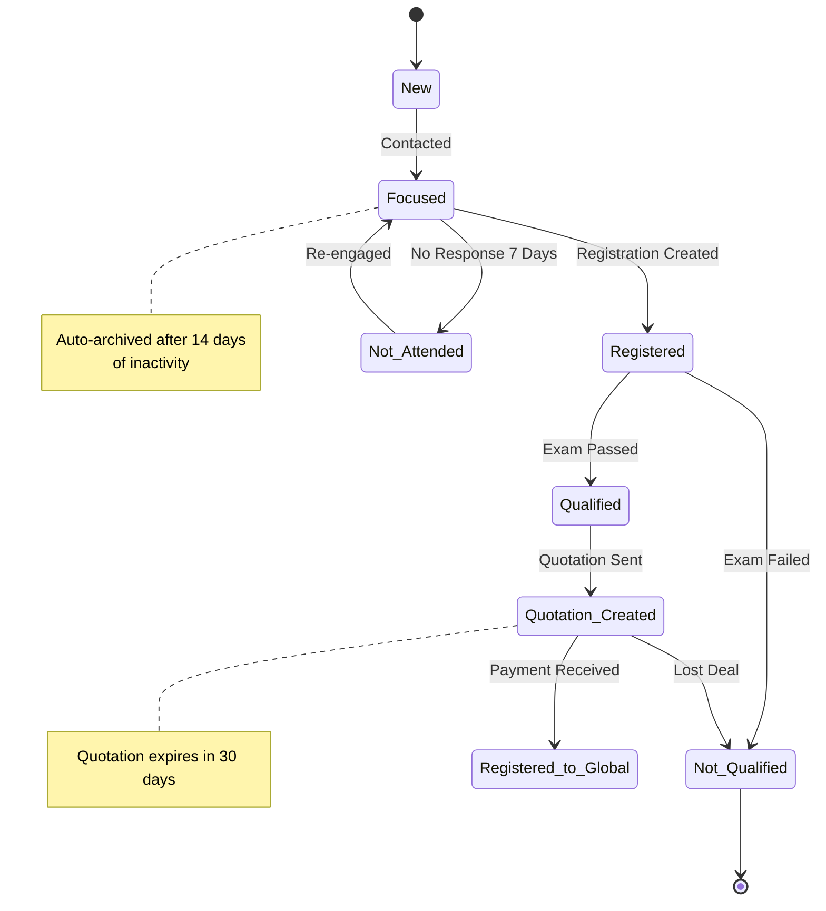
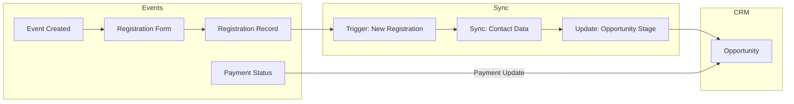
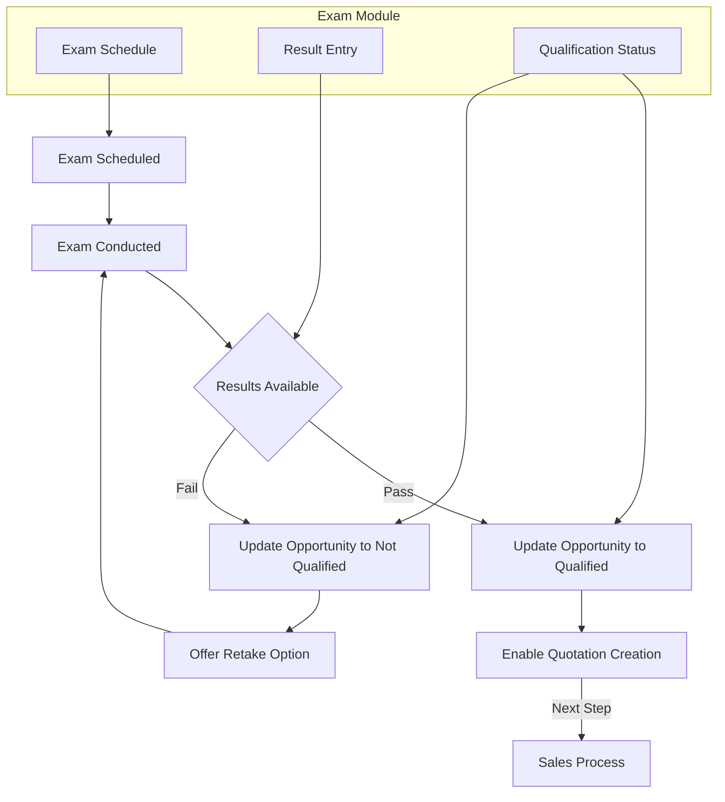
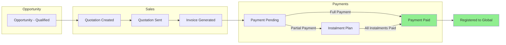
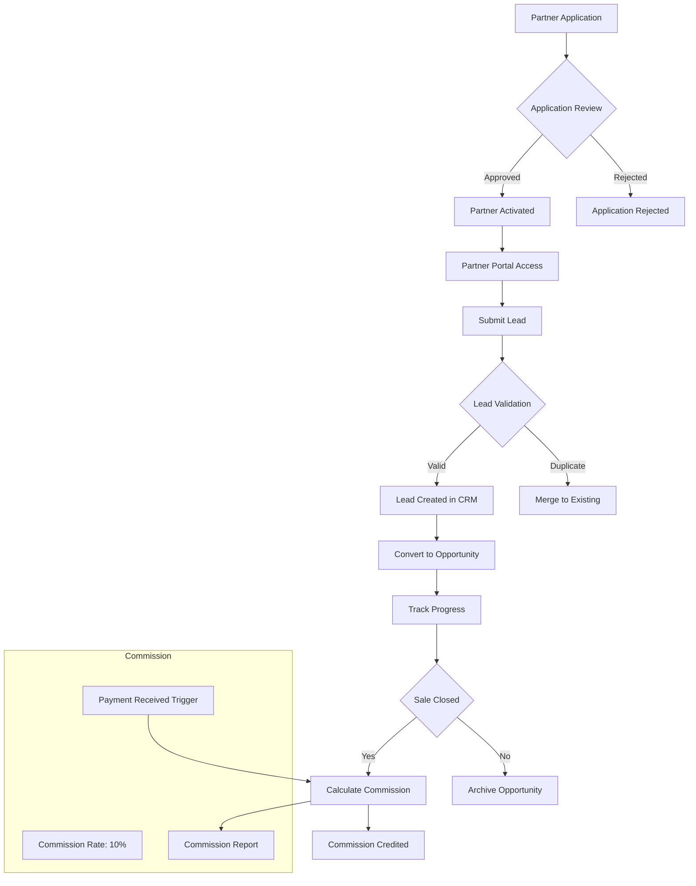
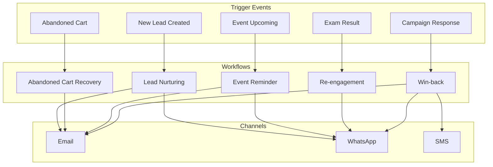

# TeenEagle CRM Business Requirement Document

**Document Version:** 1.0  
**Date:** April 2026  
**Organization:** TeenEagle (International Educational Organization)  
**Document Type:** Business Requirement Document (BRD)  
**Status:** Final

---

## 1. Executive Summary

### 1.1 Purpose

This Business Requirement Document (BRD) defines the comprehensive CRM system for TeenEagle, an international educational organization. The CRM serves as the central hub integrating all student lifecycle activities from lead capture through global event registration.

### 1.2 Business Goals

1. **Single Source of Truth**: Establish Contact as the unified identity model across all modules
2. **End-to-End Visibility**: Achieve 360-degree view of student journey from lead to registration
3. **Operational Efficiency**: Automate stage transitions, assignments, and communication flows
4. **Partner Enablement**: Empower partners with lead management and commission tracking
5. **Data Integrity**: Eliminate duplicate leads/opportunities through intelligent detection
6. **Real-Time Synchronization**: Ensure all modules Events, Exams, Sales, Marketing stay in sync

### 1.3 High-Level System Overview

The TeenEagle CRM system is built on Odoo framework and integrates six core modules:
- **CRM Module**: Leads & Opportunities management with pipeline automation
- **Events Module**: Event registration and participant tracking
- **Exams Module**: Qualification results and exam management
- **Sales Module**: Quotations, invoices, and payment tracking
- **Marketing Automation**: Campaign management and lead nurturing
- **Partner Portal**: Lead contribution and commission management

---

## 2. Scope

### 2.1 In-Scope Modules

| Module | Components |
|--------|------------|
| **CRM** | Lead capture, Opportunity pipeline, Duplicate detection, Team assignment |
| **Events** | Event registration, Participant management, Check-in tracking |
| **Exams** | Exam scheduling, Result recording, Qualification logic |
| **Sales** | Quotation management, Invoice generation, Payment tracking |
| **Marketing Automation** | Campaign workflows, Lead scoring, Re-engagement triggers |
| **Partner Portal** | Lead submission, Commission tracking, Performance dashboards |

### 2.2 Out-of-Scope

- Financial accounting beyond invoicing
- Inventory management
- HR/Employee management
- Third-party learning management system integration
- Custom mobile applications (web-based responsive only)

---

## 3. Stakeholders & User Roles

### 3.1 Role Matrix

| Role | Responsibilities | Access Level |
|------|-----------------|---------------|
| **System Administrator** | Configure system, manage users, define workflows, maintain data integrity | Full Access |
| **Sales Representative** | Manage assigned leads/opportunities, create quotations, update stage progress | Team-Scoped |
| **Partner** | Submit leads, track contributed opportunities, view commission dashboard | Partner Portal |
| **Marketing Manager** | Design campaigns, manage automation workflows, analyze lead sources | Marketing + Reports |
| **Event Manager** | Manage event registrations, coordinate event logistics, track attendance | Events + Reports |

### 3.2 Detailed Role Descriptions

#### System Administrator
- Create and manage user accounts
- Configure team structures and assignment rules
- Set up automation workflows and business rules
- Manage data import/export and deduplication
- Monitor system performance and security

#### Sales Representative
- View and manage leads/opportunities within assigned team
- Create and send quotations
- Update opportunity stages based on progress
- Log communications and activities
- Track payment status on opportunities

#### Partner
- Submit new leads through portal
- View status of contributed opportunities
- Access commission reports
- Update lead information

#### Marketing Manager
- Create and execute marketing campaigns
- Configure lead scoring rules
- Design automation workflows
- Analyze campaign performance
- Manage marketing segments

#### Event Manager
- Create and manage events
- Track event registrations
- Monitor attendance and check-in
- Coordinate with sales on registrations
- Generate event reports

---

## 4. Business Process Overview

### 4.1 Lead Management Flow



#### Business Rules
- Lead source must be captured at creation
- Duplicate detection uses email, phone, and name matching (fuzzy logic)
- Auto-assignment follows round-robin within assigned team
- Qualification requires minimum 3 touchpoints or explicit sales rep action

---

### 4.2 Opportunity Lifecycle Flow



#### Stage Definitions

| Stage | Description | Transition Criteria |
|-------|-------------|---------------------|
| **New** | Initial opportunity created | Lead converted to opportunity |
| **Focused** | Active engagement in progress | Contact made, awaiting response |
| **Registered** | Student registered for event | Event registration record created |
| **Not Attended** | Registered but did not attend | Event passed, marked no-show |
| **Qualified** | Passed qualification exam | Exam result = Pass |
| **Not Qualified** | Did not pass exam | Exam result = Fail |
| **Quotation Created** | Quotation sent to customer | Quotation generated |
| **Registered to Global** | Full registration complete | Payment received in full |

#### Validation Conditions

- **Focused → Registered**: Event registration must be linked
- **Registered → Qualified**: Exam result must be recorded as "Pass"
- **Quotation Created → Registered to Global**: Payment status must be "Paid" or "Instalment Complete"
- Stage transitions are validated by system before allowing movement

---

### 4.3 Event Integration Flow



#### Integration Logic

1. **Registration Creation**: When event registration is created, CRM opportunity stage auto-updates to "Registered"
2. **Data Sync**: Contact details (name, email, phone) sync from Events to CRM in real-time
3. **Payment Sync**: Payment status (Pending/Paid/Instalment) syncs to opportunity
4. **Attendance**: Event attendance status updates opportunity to "Qualified" or "Not Attended"

---

### 4.4 Exam Integration Flow



#### Qualification Logic

- Exam result "Pass" → Opportunity moves to "Qualified" stage
- Exam result "Fail" → Opportunity moves to "Not Qualified" stage
- "Qualified" opportunity enables quotation creation workflow
- Retake exam option available after 30 days

---

### 4.5 Sales & Payment Flow



#### Payment Status Logic

| Payment Status | Description | Opportunity Stage Impact |
|----------------|-------------|-------------------------|
| **Pending** | Awaiting payment | Quotation Created |
| **Paid** | Full payment received | Registered to Global |
| **Instalment** | Partial payment, plan active | Quotation Created |
| **Instalment Complete** | All payments received | Registered to Global |
| **Overdue** | Payment past due date | Auto-escalate to Sales Manager |

---

### 4.6 Partner Management Flow



#### Partner Business Rules

- Partner application requires approval by Admin
- Lead must have partner reference code
- Commission calculated when payment received (10% of deal value)
- Partner can only see opportunities they contributed
- Commission payout monthly via bank transfer

---

### 4.7 Marketing Automation Flow



#### Automation Rules

- **Lead Nurturing**: 5-touch sequence over 14 days for new leads
- **Abandoned Cart**: Trigger after 2 hours of cart abandonment
- **Event Reminder**: 7 days, 3 days, and 1 day before event
- **Re-engagement**: 30 days after "Not Attended" status
- **Win-back**: 90 days after "Not Qualified" or lost deal

---

### 4.8 Omni-Channel Communication Flow

```mermaid
flowchart LR
    subgraph Channels
        W[WhatsApp]
        E[Email]
        CH[Chat Widget]
    end
    
    subgraph Communication
        CV[Conversation Created]
        AI[AI Ticket Classification]
    end
    
    subgraph CRM
        L[Lead]
        O[Opportunity]
        CT[Contact]
    end
    
    W --> CV
    E --> CV
    CH --> CV
    
    CV --> AI
    AI --> L:New Lead
    AI --> O:Existing Opportunity
    AI --> CT:Existing Contact
    
    L --> CT
    O --> CT
    
    CT -->|Communication Log| CV
```

#### Communication Rules

- All communications logged against Contact record
- Incoming messages create or link to existing Lead/Opportunity
- WhatsApp conversations use phone number matching
- Email uses email address matching
- Chat uses session-based linking with follow-up prompt for details

---

## 5. Functional Requirements

### 5.1 CRM Core

#### Lead Capture
- Web form integration with custom fields
- Chat widget integration
- Campaign response capture
- Partner lead import (CSV/API)
- Manual lead entry by sales team

#### Pipeline Management
- Customizable stage pipeline (8 stages defined)
- Stage transition automation
- Weighted probability per stage
- Revenue forecasting by stage
- Pipeline analytics dashboard

#### Duplicate Detection & Merging
- Fuzzy matching on name (80% similarity)
- Exact match on email
- Exact match on phone
- Manual merge option for sales users
- Auto-merge for high-confidence matches (95%+)

### 5.2 Opportunity Management

#### Stage Automation
- Automatic stage progression based on events
- Scheduled actions for stage movement
- Custom stage triggers for each module
- Validation rules per stage transition

#### Payment Tracking
- Real-time payment status sync
- Instalment plan management
- Overdue payment alerts
- Partial payment handling

#### Event & Exam Linkage
- One-to-many relationship (Opportunity → Multiple Events)
- Exam result linkage per opportunity
- Registration history tracking

### 5.3 Sales Team Management

#### Visibility Restrictions
- Team-based record rules
- User can only see own team's opportunities
- Manager can see all team opportunities
- Admin sees all opportunities

#### Auto-Assignment
- Round-robin assignment within team
- Country-based assignment rules
- Partner-attributed leads auto-assign to partner's manager
- Reassignment on opportunity abandonment

#### Multi-Team Logic
- Team defined by country/region
- Opportunity assigned based on student's country
- Team-specific pipelines (if needed)
- Cross-team opportunity transfer with approval

### 5.4 Contact Management

#### Single Identity Model
- Contact is the master record
- All modules (CRM, Events, Exams, Sales) reference Contact
- One Contact can have multiple Opportunities
- Contact history preserved across opportunities

#### Linked Fields
- **Parent**: Linked to student Contact (one-to-many: Parent → Students)
- **Teacher**: Linked via school relationship
- **School**: Institution record linked to Contacts

### 5.5 Partner Portal

#### Lead Creation
- Partner-facing lead submission form
- Required fields: Student name, email, phone, country
- Optional: School, grade level, interest area
- Auto-assign to partner's sales team

#### Opportunity Tracking
- Real-time status of contributed opportunities
- Stage change notifications
- Revenue and commission preview

#### Commission Dashboard
- Monthly commission summary
- Transaction-level detail
- Payout history
- Performance graphs

### 5.6 Marketing Automation

#### Campaign Triggers
- Time-based triggers (delay, specific date)
- Event-based triggers (registration, payment)
- Behavioral triggers (website visit, form submission)
- Score-based triggers (lead score threshold)

#### Segmentation
- By country/region
- By lead source
- By engagement level
- By opportunity stage
- By exam qualification status

#### A/B Testing
- Subject line testing for emails
- Content variation testing
- Send time optimization
- Winner selection based on conversion

### 5.7 Attachments & Documents

#### Centralized Attachment Tracking
- All documents stored in CRM (Odoo Documents)
- Link to Contact, Opportunity, or Event
- Document categories: ID proof, Payment receipts, Certificates
- Version control for updated documents

---

## 6. Non-Functional Requirements

### 6.1 Performance
- Page load time < 3 seconds for standard views
- Search results < 2 seconds
- Bulk operations (100+ records) < 30 seconds
- Real-time sync latency < 5 seconds

### 6.2 Scalability
- Support for 50,000+ contacts
- Handle 500+ concurrent users
- Database optimization for large datasets
- Caching strategy for frequently accessed data

### 6.3 Security
- Role-based access control (RBAC)
- Field-level security for sensitive data
- Audit logging for all data changes
- GDPR compliance: Data export, right to erasure, consent management
- SSL encryption for all data transmission

### 6.4 Availability
- 99.5% uptime during business hours
- Scheduled maintenance window (Sunday 2-6 AM)
- Automated backup (daily full, hourly incremental)
- Disaster recovery plan with 4-hour RPO

### 6.5 Data Integrity
- Mandatory field validation
- Foreign key constraints
- Cascading deletes handled appropriately
- Data validation at each module boundary

---

## 7. Integration Requirements

### 7.1 Events Integration

| Aspect | Detail |
|--------|--------|
| **Sync Trigger** | On event registration create/update |
| **Data Ownership** | Events module is master for registration data |
| **Data Flow** | Events → CRM: Registration status, attendee details |
| **Error Handling** | Retry 3 times, alert Admin on failure |

### 7.2 Exams Integration

| Aspect | Detail |
|--------|--------|
| **Sync Trigger** | On exam result entry |
| **Data Ownership** | Exams module is master for exam data |
| **Data Flow** | Exams → CRM: Qualification status, score |
| **Error Handling** | Manual sync option, alert Admin |

### 7.3 Sales Integration

| Aspect | Detail |
|--------|--------|
| **Sync Trigger** | On invoice/payment create/update |
| **Data Ownership** | Sales module is master for financial data |
| **Data Flow** | Sales → CRM: Payment status, amount |
| **Error Handling** | Payment reconciliation job daily |

### 7.4 Marketing Automation Integration

| Aspect | Detail |
|--------|--------|
| **Sync Trigger** | On lead/opportunity create/update |
| **Data Ownership** | CRM is master for lead data |
| **Data Flow** | CRM → Marketing: Lead details, score, stage |
| **Error Handling** | Queue-based processing, retry |

---

## 8. Data Model Overview

### 8.1 Core Entities

```
┌─────────────────┐       ┌─────────────────┐
│    Contact      │       │      Lead       │
├─────────────────┤       ├─────────────────┤
│ id              │       │ id              │
│ name            │       │ contact_id      │──┐
│ email           │       │ source          │  │
│ phone           │       │ assigned_to     │  │
│ country_id      │       │ team_id         │  │
│ parent_id       │       │ status          │  │
│ school_id       │       └────────┬────────┘  │
└────────┬────────┘                │           │
         │                          │           │
         └──────────────────────────┘
         
┌─────────────────┐       ┌─────────────────┐
│   Opportunity   │       │Event Registration│
├─────────────────┤       ├─────────────────┤
│ id              │       │ id              │
│ contact_id      │◄──────│ opportunity_id  │
│ stage_id        │       │ event_id        │
│ team_id         │       │ contact_id      │──┐
│ event_type      │       │ status          │  │
│ payment_status  │       │ payment_status  │  │
│ qualification   │       └────────┬────────┘  │
└────────┬────────┘                │           │
         │                          │           │
         ▼                          ▼           │
┌─────────────────┐       ┌─────────────────┐
│    Invoice      │       │   Exam Result   │
├─────────────────┤       ├─────────────────┤
│ id              │       │ id              │
│ opportunity_id  │       │ opportunity_id  │◄─┐
│ amount_total    │       │ exam_id         │  │
│ state           │       │ result          │  │
│ payment_state   │       │ score           │  │
└─────────────────┘       └─────────────────┘  │
                                       │       │
                                       ▼       │
┌─────────────────┐       ┌─────────────────┐
│     Partner     │       │     Payment     │
├─────────────────┤       ├─────────────────┤
│ id              │       │ id              │
│ name            │       │ invoice_id      │
│ user_id         │       │ amount          │
│ commission_rate │       │ state           │
│ status          │       │ date            │
└─────────────────┘       └─────────────────┘
```

### 8.2 Relationship Rules

- **Contact**: One → Many Opportunities
- **Contact**: One → Many Event Registrations
- **Contact**: One → Many Exam Results
- **Opportunity**: One → Many Invoices
- **Opportunity**: One → Many Payments
- **Opportunity**: One → Many Event Registrations (but only one active at a time per event type)
- **Partner**: One → Many Leads (attributed)

---

## 9. Reporting & Dashboards

### 9.1 Standard Reports

| Report | Description | Access |
|--------|-------------|--------|
| Lead Source Analysis | Breakdown by source, conversion rates | Marketing, Sales Manager |
| Conversion Funnel | Stage-by-stage conversion rates | Sales, Admin |
| Partner Performance | Leads, conversions, commission by partner | Admin, Partner |
| Payment Tracking | Outstanding, received, overdue | Sales, Finance |
| Exam Results | Pass/fail rates by exam, location | Event Manager |
| Sales Pipeline | Revenue forecast by stage | Sales Manager |

### 9.2 Dashboard Widgets

- **CRM Dashboard**: Today's tasks, pipeline summary, upcoming events
- **Sales Dashboard**: Personal performance, team leaderboard, quota tracking
- **Marketing Dashboard**: Campaign metrics, lead score distribution
- **Partner Dashboard**: Personal leads, commission earned, ranking

---

## 10. Security & Access Control

### 10.1 Role-Based Access

| Role | CRM | Events | Exams | Sales | Marketing | Partner | Admin |
|------|-----|--------|-------|-------|-----------|---------|-------|
| Admin | Full | Full | Full | Full | Full | Full | Full |
| Sales Manager | Team | Read | Read | Full | Read | Read | - |
| Sales Rep | Own | Read | Read | Own | Read | - | - |
| Event Manager | Read | Full | Read | Read | Read | - | - |
| Marketing Manager | Read | Read | Read | Read | Full | - | - |
| Partner | - | Own | - | Own | - | Own | - |

### 10.2 Record Rules

- Sales user sees only opportunities where `team_id` = user's team
- Partner sees only opportunities where `partner_id` = self
- Marketing sees all leads/opportunities (read-only)
- Event Manager sees all event registrations

### 10.3 Data Visibility

- Contact phone/email visible to owner and team manager
- Payment details visible to Finance and Sales Manager
- Commission details visible to Partner and Admin
- Audit log accessible to Admin only

---

## 11. Automation & Business Rules

### 11.1 Stage Transitions

| Current Stage | Trigger Event | Next Stage |
|---------------|---------------|------------|
| New | First contact made | Focused |
| Focused | Event registration created | Registered |
| Focused | No activity for 14 days | Not Attended (auto-archive) |
| Registered | Exam result = Pass | Qualified |
| Registered | Exam result = Fail | Not Qualified |
| Qualified | Quotation created | Quotation Created |
| Quotation Created | Full payment received | Registered to Global |
| Any | Partner attribution | Auto-assign to partner's team |

### 11.2 Abandoned Cart Detection

- Trigger: Quotation created but no payment within 48 hours
- Action: Send automated follow-up sequence (email → WhatsApp → SMS)
- Escalation: After 7 days, alert sales rep for personal outreach

### 11.3 Payment-Driven Updates

- **Partial Payment**: Maintain "Quotation Created" stage, enable instalment tracking
- **Full Payment**: Advance to "Registered to Global" stage
- **Overdue 30+ days**: Escalate to Sales Manager, send payment reminder
- **Overdue 60+ days**: Mark opportunity as "At Risk", pause services

### 11.4 Qualification-Based Movement

- **Exam Pass**: Auto-move to "Qualified", enable quotation creation
- **Exam Fail**: Move to "Not Qualified", trigger retake offer email
- **No Exam Scheduled**: Block quotation creation, show "Exam Required" warning

---

## 12. Implementation Notes

### 12.1 Critical Success Factors

1. Single Contact identity enforced across all modules
2. Real-time sync between CRM and all integrated modules
3. Strict team-based visibility enforced via record rules
4. Partner attribution on all partner-sourced leads
5. Payment status drives final stage progression

### 12.2 Data Migration Considerations

- Existing contacts migrated as Contact records
- Historical leads imported with status preserved
- Partner data migrated with commission structure
- Event and exam history linked to contacts

### 12.3 Future Enhancements (Post-Phase 1)

- AI-based lead scoring
- Predictive conversion modeling
- Mobile app for field sales
- Advanced analytics with data warehousing

---

## Appendix A: Glossary

| Term | Definition |
|------|------------|
| Contact | Master student/parent identity record |
| Lead | Pre-qualified prospect before opportunity |
| Opportunity | Active sales pipeline record |
| Event Registration | Student registration for specific event |
| Qualified | Student passed exam and can proceed to payment |
| Partner | External organization referring leads |

---

## Appendix B: Mermaid Diagram Source

All diagrams in this document are rendered using Mermaid.js. Source code available in technical specification.

---

**Document Approval**

| Role | Name | Date | Signature |
|------|------|------|-----------|
| Business Sponsor | | | |
| Project Manager | | | |
| Technical Lead | | | |
| QA Lead | | | |

---

*End of Document*
